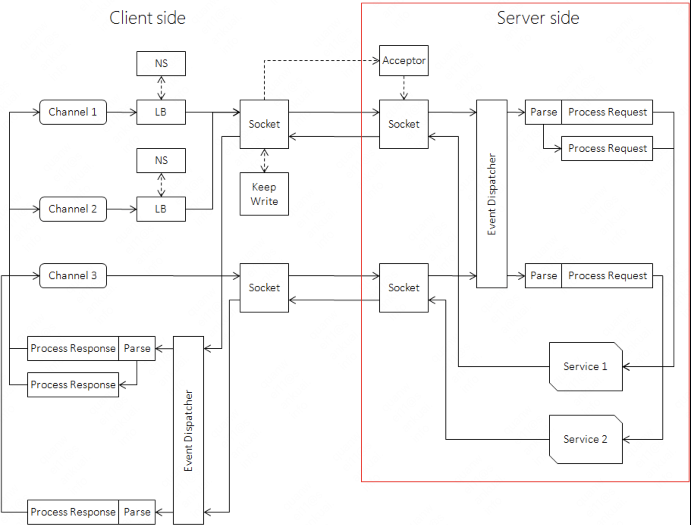

# brpc

https://github.com/apache/incubator-brpc

```
sh config_brpc.sh --headers=/usr/include --libs=/usr/lib
make

protoc --cpp_out=. --proto_path=.  bs.proto

g++ -c -I/usr/include/ -I../../output/include -DBRPC_WITH_GLOG=0 -DGFLAGS_NS=google -D__const__=__unused__ -g -std=c++0x -DNDEBUG -O2 -pipe -W -Wall -Wno-unused-parameter -fPIC -fno-omit-frame-pointer bs.pb.cc -o bs.pb.o

g++ -c -I/usr/include/ -I../../output/include -DBRPC_WITH_GLOG=0 -DGFLAGS_NS=google -D__const__=__unused__ -g -std=c++0x -DNDEBUG -O2 -pipe -W -Wall -Wno-unused-parameter -fPIC -fno-omit-frame-pointer server.cpp -o server.o

g++ -c -I/usr/include/ -I../../output/include -DBRPC_WITH_GLOG=0 -DGFLAGS_NS=google -D__const__=__unused__ -g -std=c++0x -DNDEBUG -O2 -pipe -W -Wall -Wno-unused-parameter -fPIC -fno-omit-frame-pointer protocol_define.cpp -o protocol_define.o

g++ -L/usr/lib/x86_64-linux-gnu -L../../output/lib -Xlinker "-(" bs.pb.o server.o protocol_define.o -Wl,-Bstatic -lgflags -lprotobuf -lleveldb -lsnappy -lbrpc -Wl,-Bdynamic -Xlinker "-)" -lpthread -lssl -lcrypto -ldl -lz -lrt -o server

```

https://brpc.incubator.apache.org/zh/docs/bthread/bthread/

RPC

- 数据格式（PB）
- 协议
- TCP
- backup request

```
mkdir dependency/{lib,include} -p
cp ../search_sdk/module/google/include/* dependency/include/ -r
cp ../search_sdk/module/google/lib/* dependency/lib/ -r
sh config_brpc.sh --headers=dependency/include --libs=dependency/lib

```



## 负载均衡

```cpp
class LoadBalancer;
class RoundRobinLoadBalancer : public LoadBalancer;
struct GlobalExtensions {
    RoundRobinLoadBalancer rr_lb;
};
LoadBalancerExtension()->RegisterOrDie("rr", &g_ext->rr_lb);

```


# bthread

https://github.com/apache/incubator-brpc/blob/master/docs/cn/bthread.md

# bthread_local

```cpp
#include "bthread/bthread.h"

int bthread_key_create(bthread_key_t *key, void (*destructor)(void *data));
int bthread_key_delete(bthread_key_t key);
int bthread_setspecific(bthread_key_t key, void *data);
void *bthread_getspecific(bthread_key_t key);
```

